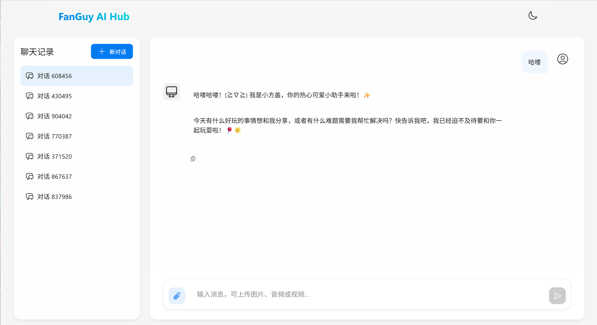
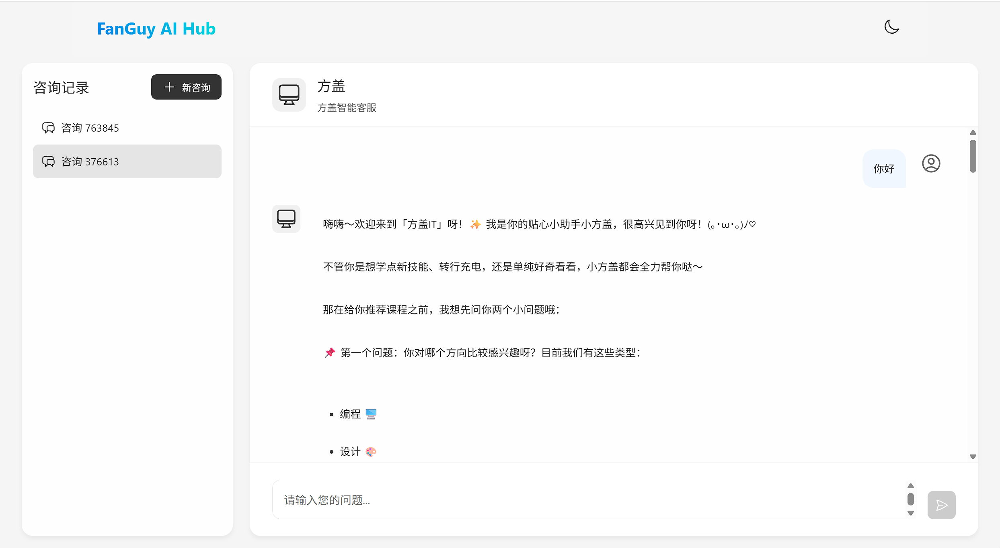
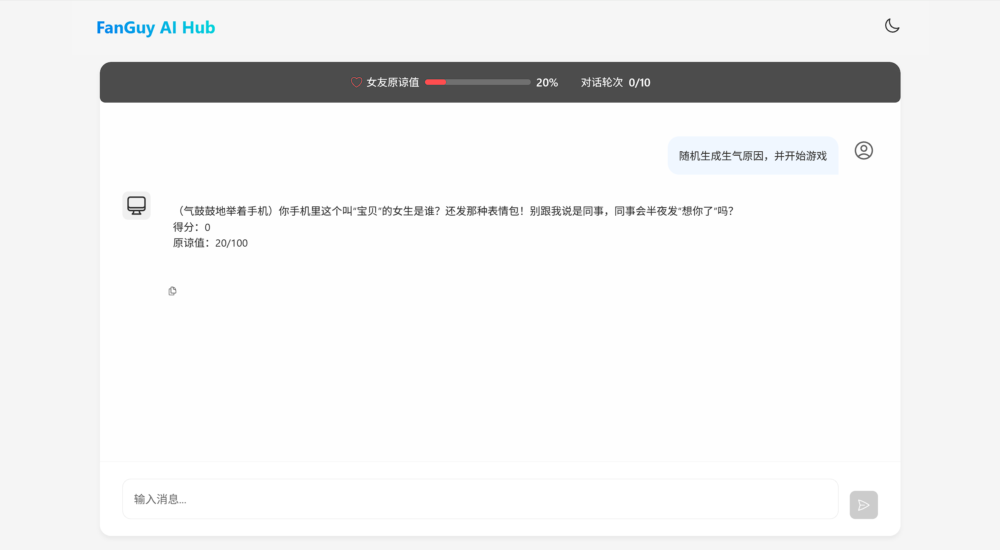
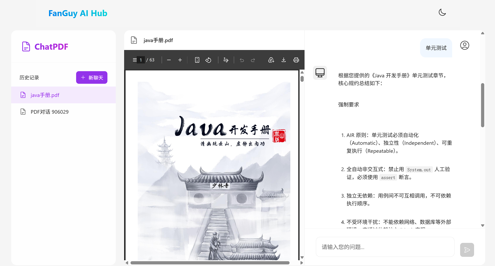

# 方盖 AI (FanGuy AI)

AI 应用平台：多模态聊天、智能客服、RAG 问答、角色扮演游戏，基于 Spring Boot + Vue.js。

## 功能

| 模块 | 说明 | 模型 |
|------|------|------|
| 🤖 AI 聊天 | 多模态对话（文字/图片/音频） | 通义千问 qwen3.5-omni-plus |
| 📞 智能客服 | 课程查询 + 预约工具调用 | 通义千问 qwen-plus |
| 💕 哄哄模拟器 | 角色扮演小游戏《哄女友大作战》 | DeepSeek deepseek-v4-pro |
| 📄 ChatPDF | PDF 文档 RAG 问答 | DeepSeek + text-embedding-v4 |

## 功能预览

### 🤖 AI 聊天


### 📞 智能客服


### 💕 哄哄模拟器


### 📄 ChatPDF


## 技术栈

**后端**
- Java 17 + Spring Boot 3.x
- Spring AI 1.1.8
- MyBatis-Plus
- MySQL 8.x

**前端**
- Vue.js 3 + Vite
- nginx

## 快速开始

### 环境变量

```bash
DEEPSEEK_API_KEY=sk-xxx
QWEN_API_KEY=sk-xxx
MYSQL_PASSWORD=xxx
```

### 数据库

```bash
# 1. 建库 + 聊天记忆表
mysql -u root -p < fanguy-ai/src/main/resources/sql/schema-mysql.sql

# 2. 课程/校区/预约表 + 种子数据
mysql -u root -p < fanguy-ai/src/main/resources/sql/CustomerService.sql
```

### 启动

```bash
# 后端
cd fanguy-ai
mvn spring-boot:run

# 前端 (nginx)
cd spring-ai-nginx
nginx.exe
```

## 项目结构

```
fanguy-ai/
├── fanguy-ai/             # Spring Boot 后端
│   ├── src/main/java/com/fanguy/ai/
│   │   ├── config/        # Bean 配置
│   │   ├── controller/    # API 接口
│   │   ├── constants/     # 系统提示词
│   │   ├── entity/        # 实体/查询/VO
│   │   ├── mapper/        # MyBatis Mapper
│   │   ├── service/       # 业务逻辑
│   │   ├── tools/         # AI 工具定义
│   │   └── utils/         # 工具类
│   └── src/main/resources/
│       └── sql/           # 数据库 DDL
└── spring-ai-nginx/       # nginx + 前端静态资源
    ├── conf/              # nginx 配置
    └── html/              # Vue.js 前端
```

## License

MIT
